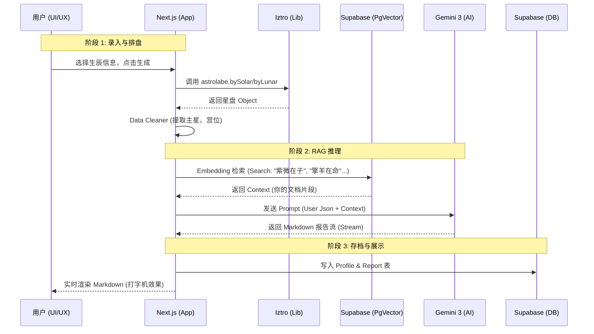

# Project PRD: AI-Powered Ziwei Astrologist (MVP)

**Version:** 1.0 (MVP)
**Status:** Approved
**Date:** 2025-12-01

## 1\. 战略概览 (Strategic Overview)

### 1.1 核心愿景 (Mission)

打造一款面向大众的“黑白极简主义”紫微斗数 AI 报告工具。通过 `iztro` 引擎保证排盘准确性，结合 RAG + Gemini 提供通俗易懂的性格与命运解析。作为“引流钩子 (Lead Magnet)”，通过高质量的免费/低门槛报告建立信任，最终将高意向用户转化为高客单价的 1对1 咨询服务。

### 1.2 用户画像 (Target Persona)

  * **代号**：探寻者 (The Seeker)
  * **特征**：20-35 岁，对自身命运好奇但零基础，习惯移动端阅读。
  * **痛点**：看不懂传统排盘软件（全是术语），觉得线下算命不透明且昂贵。
  * **需求**：操作简单（别让我填奇怪的参数），报告看得懂（说人话），界面好看（想截图发朋友圈）。

-----

## 2\. 产品路线图 (Product Roadmap)

### V1: MVP (本次开发目标) - "The Mirror"

  * **核心功能**：
      * **精准排盘**：集成 `iztro`，支持公历/农历选择输入。
      * **AI 解盘**：基于用户提供的知识库 (RAG)，生成本命盘（性格+核心宫位）的长文报告。
      * **卷轴体验**：单页应用，瀑布流式阅读，黑白神秘风格。
      * **档案系统**：用户登录 (手机/微信)，保存并管理自己和亲友的命盘数据。
      * **转化钩子**：报告底部的咨询预约入口。

### V2: Future Releases (未来规划)

  * **AI Chatbot**：基于当前报告进行追问（Oracle Mode）。
  * **运势模块**：大限（10年运）与流年（当年运）解析。
  * **合盘分析**：双人档案匹配度。
  * **支付网关**：解锁高级报告或支付咨询定金。

-----

## 3\. 业务规则与数据契约 (Business & Data)

### 3.1 关键业务逻辑

1.  **输入限制**：必须使用下拉/滚动选择器输入日期和时间，禁止手动输入文本，确保 `iztro` 接收到的参数格式 100% 正确。
2.  **报告生成机制**：
      * `Iztro` 生成星盘 JSON。
      * 后端提取 `命宫`、`身宫` 及 `三方四正` 的主星与核心辅星。
      * RAG 检索对应星曜解释。
      * Gemini 负责润色汇总，输出 Markdown。
3.  **用户权限**：未登录用户可体验输入流程，但生成报告前需登录/注册（或生成后仅展示 30%，解锁全文需登录，根据开发难度，MVP 建议先做**登录后生成**，以确保数据留存）。

### 3.2 数据契约 (Data Schema - Supabase)

**Table: `profiles` (档案表)**
| Field | Type | Note |
| :--- | :--- | :--- |
| `id` | UUID | Primary Key |
| `user_id` | UUID | 关联 Auth 用户 |
| `name` | String | 档案人姓名 |
| `gender` | String | 'male' / 'female' |
| `birth_type` | String | 'solar' (公历) / 'lunar' (农历) |
| `birth_date` | String | ISO 格式日期 |
| `birth_hour` | Integer | 0-23 (时辰) |
| `metadata` | JSONB | 预留字段 |

**Table: `reports` (报告表)**
| Field | Type | Note |
| :--- | :--- | :--- |
| `id` | UUID | Primary Key |
| `profile_id` | UUID | FK -\> profiles.id |
| `iztro_data` | JSONB | 原始星盘数据快照 |
| `content` | Text | 生成的 Markdown 报告 |
| `created_at` | Timestamp | |

-----

## 4\. MVP 原型设计：卷轴式 (The Scroll)

**设计风格**：黑底白字 (Dark Mode Only)，衬线字体 (Serif)，微动效 (Framer Motion)，留白充足。

### 界面流程 ASCII 演示

**Screen 1: The Entry (录入)**

```text
+---------------------------------------+
|  [Logo] MYSTIC LAB            [Login] |
|                                       |
|      探索你的                               |
|      先天命运代码                           |
|                                       |
|  +---------------------------------+  |
|  |  姓名: [ 张三            ] v |  |  <- 输入框
|  +---------------------------------+  |
|  |  性别: [ 男 ]  [ 女 ]        |  |  <- 按钮组
|  +---------------------------------+  |
|  |  历法: [ 公历 ]  [ 农历 ]     |  |  <- Tab切换
|  +---------------------------------+  |
|  |  日期: [ 1995 ] [ 08 ] [ 24 ]   |  |  <- 滚动选择器
|  +---------------------------------+  |
|  |  时辰: [ 辰时 (07:00-09:00) ] v |  |  <- 下拉选择
|  +---------------------------------+  |
|                                       |
|          [  开启命盘  ]                |
|       (Button: Hover 发光效果)         |
+---------------------------------------+
```

**Screen 2: The Loading (仪式感)**

```text
+---------------------------------------+
|                                       |
|           ★      * .             |
|       .       (动画)        * |
|            星辰排列中...                |
|                                       |
|    "紫微星正在入庙..."                  |
|    "正在读取知识库..."                  |
|                                       |
+---------------------------------------+
```

**Screen 3: The Scroll (报告页)**

```text
+---------------------------------------+
|  < 返回列表               [分享/保存]   |
|                                       |
|  # 张三的命盘报告                       |
|  -----------------------------------  |
|  [ 命宫 ] : 紫微 · 天府                |
|  [ 状态 ] : 旺                        |
|                                       |
|  ## 核心性格侧写                       |
|                                       |
|  你的命宫主星为紫微天府。这意味着你...     |
|  (RAG 检索到的内容经 Gemini 润色)       |
|                                       |
|  > "君子不器，周而不比。"               |
|                                       |
|  ## 事业潜能 (官禄宫)                  |
|  ...                                  |
|                                       |
|  ## 情感模式 (夫妻宫)                  |
|  ...                                  |
|                                       |
|  -----------------------------------  |
|          需要更深度的指引？             |
|      [ 预约咨询师 (¥???) ]             |
|                                       |
+---------------------------------------+
```

-----

## 5\. 架构设计蓝图 (Architecture Blueprint)

### 5.1 核心流程图 (Flowchart)



### 5.2 组件交互与文件结构影响

  * **新增模块**:
      * `src/lib/iztro-engine.ts`: 专门封装 `iztro` 的调用，处理中英文映射，简化输出格式。
      * `src/lib/rag-client.ts`: 处理与 Supabase Vector 的交互。
      * `src/app/api/analyze/route.ts`: 核心业务端点。
      * `src/components/scroll-view/`: 包含 `DatePicker`, `StarChart`, `MarkdownRenderer` 等 UI 组件。
  * **知识库处理**:
      * 我们需要编写一个脚本 `scripts/ingest-docs.ts`，用于在开发阶段将你提供的 `.txt/.md` 文档切片并存入 Supabase。

### 5.3 技术选型与风险

1.  **Framework**: **Next.js 14 (App Router)** - 最佳的 React 框架，易于部署 Vercel。
2.  **Database**: **Supabase** - 同时解决 Auth (登录), Database (存储), Vector (RAG) 三大问题，开发效率极高。
3.  **Core Lib**: **iztro** - 项目核心。
4.  **AI**: **Google Gemini API** (via Vercel AI SDK) - 长文本处理能力强，成本可控。
5.  **Risk Mitigation (风险控制)**:
      * *Input Accuracy*: 使用 `lunar-javascript` 库辅助处理农历/公历转换，确保传给 `iztro` 的时间准确。
      * *Prompt Injection*: 在 System Prompt 中严格限制 AI 只能扮演命理师，不能回答政治/敏感问题。

-----
